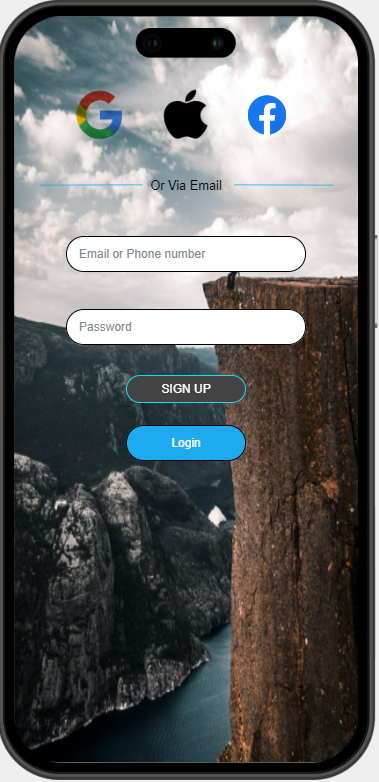
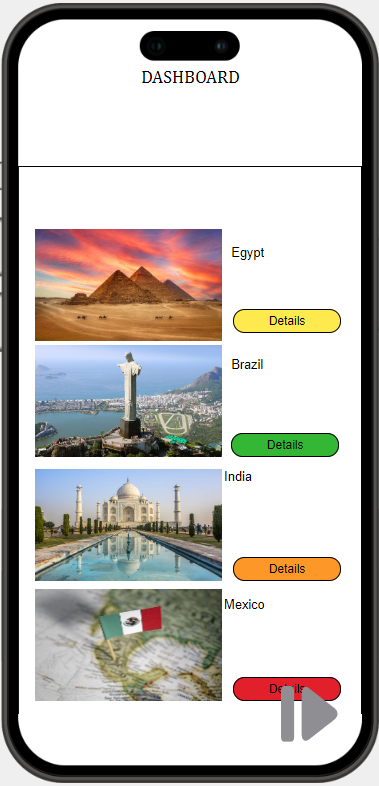

# cen4010-prin-soft-eng-final-project-final-project-001-group-24
cen4010-prin-soft-eng-final-project-final-project-001-group-24 created by GitHub Classroom

# Map Companion App
The Map Companion app is a geographical convenience app meant to inform users on facts and information of the available options given to them. With this app users will be able to access information such as stories and information about certain geological locations. 

The Main Objective of this app is to provide the user with information based on a geographical location of thier choice.

The main focus of this app being convience and helpfulness will drive development in the future such as a register component with timed aplications. Look forward to it!

# Features
- Login/Signup page for users to set up an account with in order to successfully interact with the app.

- Scrollable list of Historical Landmarks and information of each piece.

- Interactivity with user using navigation and detail buttons.

# Details
- The Map Companion App integrates the [GeoApify](https://www.geoapify.com/places-api) API in order to increase the amount of information available to the user and expand on the point of interest.
- Contains multiple dependecies needed to run such as express, Swagger, .env and more.
- The app is currently being deployed using [vercel](https://vercel.com/home) and has been assembled using [JustInMind](https://www.justinmind.com/?k=justinmind&a=295677078132&adg=23874442871&cmp=323175791&match=e&adposition=&utm_medium=cpc&utm_source=google&utm_campaign=323175791&utm_term=justinmind_e&gad_source=1&gclid=CjwKCAiA98WrBhAYEiwA2WvhOhFfT8isVP3FyOw_0Xm1bnbZ_-3wzuYOWsIC9_ved-UaY5OIRbKXyxoC_qsQAvD_BwE).

# License
MIT

# The app is available for use
- Link to Website: 

# Workload
Jerry Gutierrez
- log in 
- sign in
- test functions

Maxx Parcesepe
- Set up up server/database
- Style changes

Joshua Fredrick
- set up map api 
- data and time page 

steven pierre
- Integrate Map api and Database
- home page

